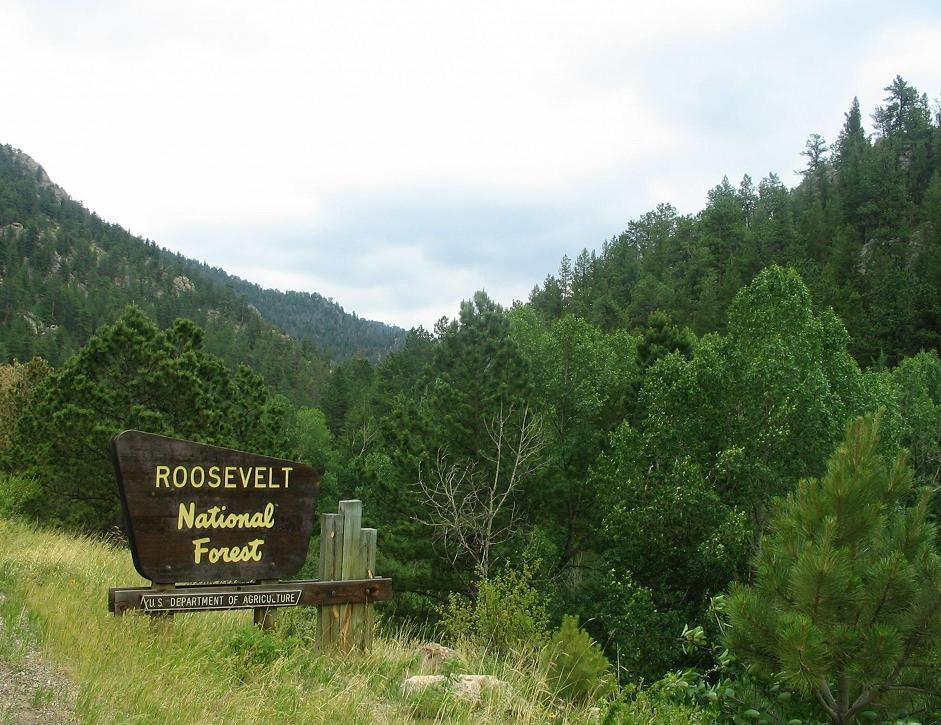

# 🌲 Forest Cover Type Prediction using Machine Learning

In this project 4 different supervised machine learning models were used to predict forest cover types in 4 different forest belonging to the **Roosevelt National Forest** in Colorado, USA.

The dataset used in this project can be accessed both in [Kaggle](https://www.kaggle.com/datasets/uciml/forest-cover-type-dataset?resource=download) and University of California, Irvine's ML [Repository](https://archive.ics.uci.edu/dataset/31/covertype). The dataset comes from *Comparative accuracies of artificial neural networks and discriminant analysis in predicting forest cover types from cartographic variables*, an article published in *Computers and Electronics in Agriculture*.



## 📌 Project Overview
We compare several supervised classification algorithms to evaluate their performance on a complex, high-dimensional dataset.
The main goals were:
- **Performance comparison**: Identify which classical ML algorithm performs best on this dataset.
- **Surpass the accuracy** of the Artificial Neural Network used in the original study.
- **Dimensionality analysis**: Explore the impact of removing categorical variables and applying PCA.

## 📂 Repository Structure:

The repository is organized as follows (only directories with relevant files are listed; others serve support purposes):
```
notebooks/
|---data_cleansing_&_EDA.ipynb  # Initial exploration of the dataset, including distribution and properties of key variables and the target variable.
|---models.ipynb                # Comparison and analysis of models (KNN, Decision Trees, Random Forest, AdaBoost). Also includes PCA for dimensionality reduction and an analysis of the effect of removing some categorical features.
data/
|---raw/
    |---covtype.csv              # Dataset in CSV format.
    |---covtype.info             # Summary of the dataset information from the paper.
app/
|---app.py                       # Streamlit app providing a visual interface to input data and predict the forest cover type of a new plot of land.
```

## Results and conclusions:

1. K-Nearest Neighbours performs poorly on highly dimensional datasets.
2. Decision Tree classifiers achieve good metrics with low computational cost and outperform the Gaussian Discriminant Analysis model.
3. The two ensemble models used, Random Forest and AdaBoost, achieved better results than the Artificial Neural Network from the original study. This shows that, under certain circumstances, classical machine learning algorithms can match or even surpass neural networks.
4. Dimensionality reduction (PCA) did not improve performance.

## Dependencies:

- Pandas
- Matplotlib
- Seaborn
- Scikit-learn